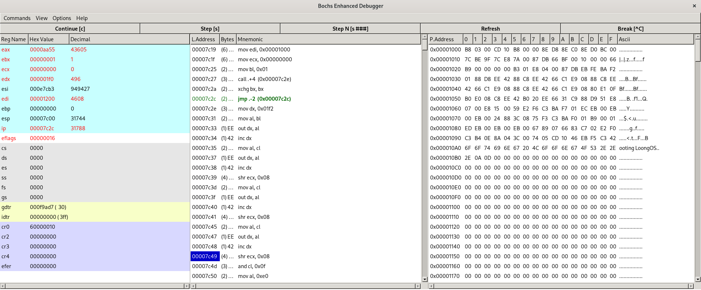

# 006 硬盘读写

## 1. 原理说明

### 1.1 硬盘读写

- CHS 模式 / Cylinder / Head / Sector
- LBA 模式 / Logical Block Address

LBA28，总共能访问 128GB 的磁盘空间（因为一个扇区有 512 字节，所以总共有 2^(28+9) Bytes = 128GB）。

### 1.2 硬盘控制端口

| Primary 通道            | Secondary 通道 | in 操作      | out 操作     |
| ----------------------- | -------------- | ------------ | ------------ |
| 0x1F0                   | 0x170          | Data         | Data         |
| 0x1F1                   | 0x171          | Error        | Features     |
| 0x1F2                   | 0x172          | Sector count | Sector count |
| 0x1F3                   | 0x173          | LBA low      | LBA low      |
| 0x1F4                   | 0x174          | LBA mid      | LBA mid      |
| 0x1F5                   | 0x175          | LBA high     | LBA high     |
| 0x1F6                   | 0x176          | Device       | Device       |
| 0x1F7                   | 0x177          | Status       | Command      |

我们只关心 Primary 通道即可。注意除了 0x1F0 端口的寄存器为 16 bit 之外，其余端口的寄存器均为 8 bit。in 操作为将数值从端口寄存器读取到通用寄存器，out 操作为将数值从通用寄存器写入到端口寄存器。

- 0x1F0：16 bit 端口，用于读写数据
- 0x1F1：检测前一个指令的错误
- 0x1F2：读写扇区的数量
- 0x1F3：起始扇区的 0 ~ 7 位
- 0x1F4：起始扇区的 8 ~ 15 位
- 0x1F5：起始扇区的 16 ~ 23 位
- 0x1F6:
    - 0 ~ 3：起始扇区的 24 ~ 27 位
    - 4: 0 主盘, 1 从片
    - 6: 0 CHS, 1 LBA
    - 5 ~ 7：固定为1
- 0x1F7: out
    - 0xEC: 识别硬盘
    - 0x20: 读硬盘
    - 0x30: 写硬盘
- 0x1F7: in / 8bit
    - 0 ERR
    - 3 DRQ 数据准备完毕（当 bit 3 为 1 时）
    - 7 BSY 硬盘繁忙（当 bit 7 为 1 时）

## 2. 硬盘读取

### 2.1 代码分析

下面的代码的效用为，将主引导扇区读取到 0x1000 地址处。该函数调用完成后，地址 0x1000 和 0x7c00 开始的 512 个字节的内容相同。

```x86asm
; 读取硬盘的内容到指定的内存地址处
mov edi, 0x1000     ; 读取硬盘到的目标内存地址
mov ecx, 0          ; 起始扇区的编号
mov bl, 1           ; 读取的扇区数量

call read_disk
```

```x86asm
read_disk:
    ; 设置读取扇区的数量
    mov dx, 0x1f2   ; 0x1f2 端口
    mov al, bl
    out dx, al

    ; 设置起始扇区的编号
    inc dx          ; 0x1f3 端口
    mov al, cl      ; 起始扇区编号的 0-7 位
    out dx, al

    inc dx          ; 0x1f4 端口
    shr ecx, 8      ; 寄存器 ecx 逻辑右移 8 位
    mov al, cl      ; 起始扇区编号的 8-15 位
    out dx, al

    inc dx          ; 0x1f5 端口
    shr ecx, 8      ; 寄存器 ecx 逻辑右移 8 位
    mov al, cl      ; 起始扇区编号的 16-23 位
    out dx, al

    inc dx          ; 0x1f6 端口
    shr ecx, 8      ; 寄存器 ecx 逻辑右移 8 位
    and cl, 0x0f    ; 将寄存器 cl 的高 4 位置零

    mov al, 0xe0    ; 将 0x1f6 端口 5-7 位置 1，即主盘 - LBA 模式
    or al, cl
    out dx, al

    inc dx          ; 0x1f7 端口
    mov al, 0x20    ; 设置为读硬盘操作
    out dx, al

    xor ecx, ecx    ; 将寄存器 ecx 清空
    mov cl, bl      ; 将 cl 置为读取扇区的数量，配合后续的 loop 指令使用

    .read:
        push cx     ; 保存 cx（因为 .reads 中修改了 cx 的值）
        call .waitr ; 等待硬盘数据准备完毕
        call .reads
        pop cx      ; 恢复 cx
        loop .read

    ret

    .waitr:
        mov dx, 0x1f7   ; 0x1f7 端口
        .check:
            in al, dx
            jmp $+2         ; 直接跳转到下一条指令，相当于 nop，其作用为提供延迟
            jmp $+2
            jmp $+2
            and al, 0x08    ; 读取 0x1f7 端口的第 3 位和 第 7 位
            cmp al, 0x08    ; 判断数据是否准备完毕
            jnz .check
        ret
    
    .reads:
        mov dx, 0x1f0   ; 0x1f0 端口（为 16 bit 的寄存器）
        mov cx, 256     ; 一个扇区一般是 512 字节（即 256 字）
        .readword:
            in ax, dx
            jmp $+2         ; 提供延迟
            jmp $+2
            jmp $+2
            mov [edi], ax   ; 将读取数据写入到指定的内存地址处
            add edi, 2
            loop .readword
        ret

```

### 2.2 效果示意

#### 内存 0x1000 的内容

`call read_disk` 之前：


`call read_disk` 之后：


#### 内存 0x7c00 的内容


观察可知，地址 0x1000 与 0x7c00 起始的 512 字节内容相同，成功正确地读取硬盘内容！！！

## 3. 硬盘写入

### 3.1 代码分析
 
硬盘写入的实现与硬盘读取的实现类似，只需修改一些逻辑即可。

```x86asm
write_disk:
    ...
    inc dx          ; 0x1f7 端口
    mov al, 0x30    ; 设置为写硬盘操作
    out dx, al
    ...
    .write:
        push cx     ; 保存 cx（因为 .writes 中修改了 cx 的值）
        call .writes
        call .waitw ; 等待硬盘繁忙结束
        pop cx      ; 恢复 cx
        loop .write
    ...
    .waitw:
        mov dx, 0x1f7   ; 0x1f7 端口
        .check:
            in al, dx
            jmp $+2         ; 直接跳转到下一条指令，相当于 nop，其作用为提供延迟
            jmp $+2
            jmp $+2
            and al, 0x80    ; 保留 0x1f7 端口的第 7 位
            cmp al, 0x80    ; 判断数据是否准备完毕
            jz .check
        ret
    
    .writes:
        mov dx, 0x1f0   ; 0x1f0 端口（为 16 bit 的寄存器）
        mov cx, 256     ; 一个扇区一般是 512 字节（即 256 字）
        .writeword:
            mov ax, [edi]
            out dx, ax  ; 将要写入的数据写入到指定端口处
            jmp $+2     ; 提供延迟
            jmp $+2
            jmp $+2
            add edi, 2
            loop .writeword
        ret
```

### 3.2 检查是否写入成功

将 0x1000 地址处的内容写入编号为 2 的扇区中，因为先前已经将主引导扇区（即编号为 0 的扇区）写入到 0x1000 处，所以调用 `write_disk` 的预期效果为扇区 0 和扇区 2 的内容一致。

```x86asm
; 将指定内存地址处的内容写入到硬盘
mov edi, 0x1000     ; 要写入的数据在内存的起始地址
mov ecx, 2          ; 起始扇区的编号
mov bl, 1           ; 写入的扇区数量

call write_disk
```

在 `master.img` 中，`[0x0000000, 0x00000200)` 表示扇区 0，`[0x00000400, 0x00000600)` 表示扇区 2，我们检查 `master.img` 的数据可知，已经成功将 0x1000 地址起始的 512 字节写入到扇区 2 中!!!