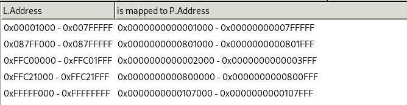
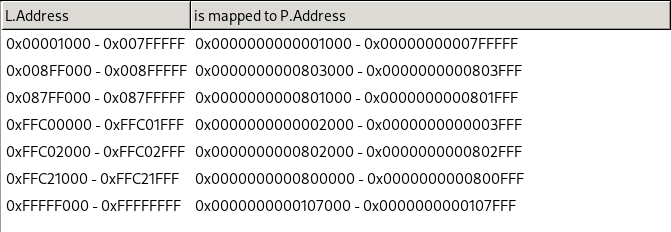
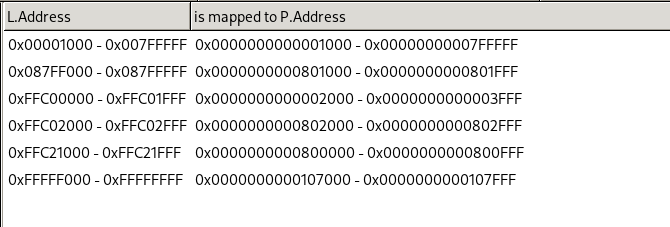

# 068 系统调用 brk

## 1. 原理说明

`brk` 是 break 的缩写，以下节选手册内容（可通过 `man 2 brk` 查看）：

> **DESCRIPTION**   
       **brk()** and **sbrk()** change the location of the *program break*, which defines the
       end of the process's data segment (i.e., the program break is the first loca‐
       tion after the end of the uninitialized data segment).  Increasing  the  pro‐
       gram break has the effect of allocating memory to the process; decreasing the
       break deallocates memory.

可以看出，`brk` 的作用就是用来修改用户堆内存的上限，因为它修改的是堆的结束位置。以下为用户空间内存分布示意图：


我们将之前的内核空间分布抽象为了，位于 $0x001000$ ~ $0x800000$ 虚拟地址区域的 **内核专用** 部分。而将用户程序对应的 ELF 文件映射到了 $0x800000$ $0x8800000$ 虚拟地址区域，我们可以看到用户程序包含很多段，比如 text, data, bss 等等，同时还有用户栈、用户堆。

## 2. 代码实现

### 2.1 Linux 兼容

为了和 Linux 兼容，我们将系统调用号修改为和 Linux 一致。我们可以通过头文件 `asm/unistd_32.h` 来查看 32 位 Linux 的系统调用号。由于 Linux 系统调用号的原因，我们需要将系统调用数量 `SYSCALL_SIZE` 由 64 扩大至 256，以兼容 `yield` 和 `sleep` 的系统调用号。

```c
//--> include/xos/syscall.h

// 共 256 个系统调用
#define SYSCALL_SIZE 256

// 系统调用号
typedef enum syscall_t {
    SYS_TEST,
    SYS_WRITE   = 4,
    SYS_BRK     = 45,
    SYS_YIELD   = 158,
    SYS_SLEEP   = 162,
} syscall_t;
```

### 2.2 brk 地址

根据原理说明，系统调用 `brk` 是用于修改用户空间堆内存的最高地址。所以我们需要在 TCB 中加入一个成员 `brk`，用于记录堆内存的最高地址，方便在处理系统调用时，根据记录的 `brk` 值大小，对虚拟内存进行映射和取消映射操作，同时也可以防止非法访问内存操作。

```c
//--> include/xos/task.h

// 任务控制块 TCB
typedef struct task_t {
    ...
    u32 brk;                    // 任务堆内存最高地址
    u32 magic;                  // 内核魔数（用于检测栈溢出）
} task_t;
```

在创建 task 时，我们需要设置 task 的 `brk` 值。由于在创建 task 时，并不会加载用户程序的 ELF 文件进入用户空间，所以我们仅仅设置新建 task 的 `brk` 值为内核专用区域的结束位置。当然在后续加载用户程序的 ELF 文件时，我们需要按照 ELF 文件提供的信息来重新设置 task 的 `brk` 值。

```c
//--> kernel/task.c

// 创建一个默认的任务 TCB
static task_t *task_create(target_t target, const char *name, u32 priority, u32 uid) {
    ...
    task->brk = KERNEL_MEMORY_SIZE;
    task->magic = XOS_MAGIC;

    return task;
}
```

### 2.3 系统调用 brk

在 TCB 中记录 `brk` 地址后，现在我们就可以来实现系统调用 `brk` 了。

#### 2.3.1 注册调用链

```c
//--> inlude/xos/syscall.h

// 系统调用号
typedef enum syscall_t {
    ...
    SYS_BRK = 45,       // new
    ...
} syscall_t;

/***** 声明用户态封装后的系统调用原型 *****/
...
i32 brk(void *addr);    // new


//--> lib/syscall.c

// new
i32 brk(void *addr) {
    return _syscall1(SYS_BRK, (u32)addr);
}


//--> kernel/syscall.c

// 初始化系统调用
void syscall_init() {
    ...
    syscall_table[SYS_BRK] = sys_brk;   // new
}
```

#### 2.3.2 **sys_brk**

我们将系统调用 `brk` 的内核处理函数 `sys_brk()` 放置在内存管理模块 `memory.c` 中，因为这个系统调用与内存管理相关。

- 为了内存管理的便利性，我们需要保证 `brk` 地址是页对齐的。
- 只有用户程序才能触发这个系统调用。
- 对于每次系统调用 `brk(addr)`，我们需要将 `addr` 与 task 记录的 `brk` 地址进行比较：
    - 如果原先的 `brk` 小于 `addr`，我们只需更新 `brk` 记录即可。
    - 如果原先的 `brk` 大于 `addr`，我们除了更新 `brk` 记录外，还需要对缩减的堆内存区域，进行取消映射操作。
- 如果需要扩展的内存区域大小，大于系统可用的空闲内存大小，则返回 -1，表示内存超限 **out of memory**。

```c
//--> kernel/memory.c

i32 sys_brk(void *addr) {
    LOGK("task brk 0x%p\n", addr);
    
    // 保证 brk 的地址是页的起始地址
    u32 brk = (u32)addr;
    ASSERT_PAGE_ADDR(brk);

    // 保证触发 brk 的是用户态进程
    task_t *current = current_task();
    assert(current->uid != KERNEL_TASK);

    // 保证 brk 的地址位于合法范围
    assert(KERNEL_MEMORY_SIZE <= brk && brk < USER_STACK_BOOTOM);

    u32 old_brk = current->brk; // 原先的 brk 地址
    if (old_brk > brk) {
        // 如果原先的 brk 地址高于指定的 brk 地址
        for (u32 addr = brk; addr < old_brk; addr += PAGE_SIZE) {
            unlink_page(addr);
        }
    } else if (PAGE_IDX(brk - old_brk) > mm.free_pages) {
        // 如果指定的 brk 地址高于原先的 brk 地址，且需要扩展的内存大于空闲内存
        return -1; // out of memory
    }

    // 更新进程的 brk 地址
    current->brk = brk;
    return 0;
}
```

细心的读者可以发现，我们只是对堆内存缩减的情况进行了取消映射操作，而对堆内存扩展的情况仅仅是更新了 task 记录的 `brk` 值，并没有对扩展的堆内存进行映射操作。那我们怎么保证不会触发 `Page Fault` 呢？

其实触发 `Page Fault` 并没有问题，我们上一节就利用了 `Page Fault` 来实现了用户栈的用时分配 / 懒分配 lazy allocation。所以对于用户堆内存，我们也采用这种分配策略。

### 2.4 Lazy Allocation

```c
//--> kernel/interrupt.c

// 缺页异常处理函数
void page_fault_handler(...) {
    ...
    task_t *current = current_task();

    // 如果缺页异常发生在用户栈或用户堆范围内
    if (!page_error->present && page_error->user 
        && (vaddr < current->brk || vaddr > USER_STACK_BOOTOM)
    ) {
        u32 vpage = PAGE_ADDR(PAGE_IDX(vaddr));
        link_page(vpage);
        return;
    }
    ...
}
```

## 3. 功能测试

### 3.1 测试样例

修改用户线程 `user_init_thread`，使得它可以测试系统调用 `brk`。

```c
//--> kernel/thread.c

static void user_init_thread() {
    size_t counter = 0;

    while (true) {
        char *ptr;
        
        ptr = (char *)0x900000;
        brk(ptr);                   // BMB 1

        ptr -= 0x1000;
        ptr[3] = 'T';               // BMB 2

        ptr = (char *)0x800000;
        brk(ptr);                   // BMB 3

        sleep(1000);
    }
}
```

使用 Bochs 在各个 BMB 处观察 task 对应的页表映射内容的变化，进一步理解堆内存扩展时的 lazy allocation 策略，以及堆内存缩减时的立刻取消映射机制。

### 3.2 UBMB

由于之前的 `BMB` 宏使用了 `printk` 来打印文件名、行号等信息，我们无法在用户态使用它。而内联汇编又过于繁琐，所以我们定义一个用户态的 `UBMB` 宏。我们仅仅实现了 bochs magic breakpoint，并没有使用 `printf` 来使得 `UBMB` 像 `BMB` 宏一样打印信息，当然这个实现非常简单，可以自行实现。

```c
//--> kernel/thread.c

#define UBMB asm volatile("xchgw %bx, %bx");
```

### 3.3 断点观察页表

BMB 1



- 恒等映射了内核专用区域，一页空间的用户栈，以及递归映射了页表自身。
- 由于 lazy allocation，本次调用 `brk()` 后并不会进行映射。

---

BMB 2



- 由于访问了合法的堆内存区域，所以 lazy allocation 策略分配一页堆内存，并进行了映射。

---

BMB 3



- 本次调用 `brk()` 用于缩减堆内存区域，所以立即就取消了缩减区域的映射。
