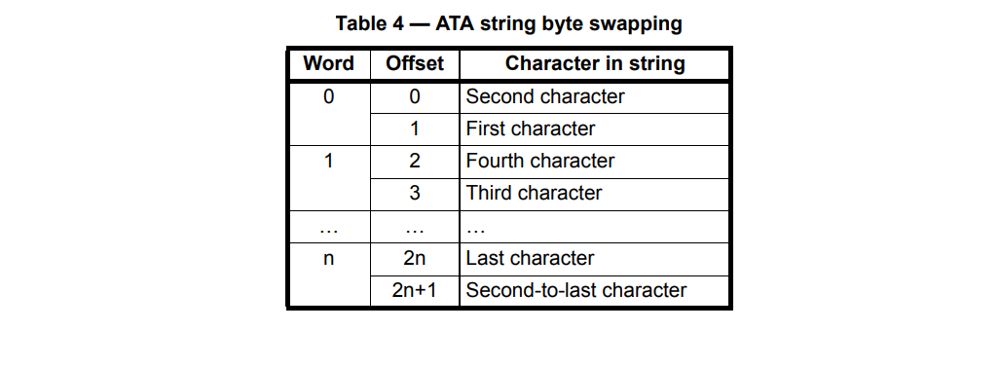

# 076 识别硬盘

## 1. 标准和非标准检测

目前所有的 BIOS 都标准化了 IDENTIFY 命令的使用，以检测所有类型的 ATA 总线设备的存在 PATA, PATAPI, SATAPI, SATA。

还有另外两种不推荐使用的非标准技术：

- 第一个是选择一个设备(然后做 400ns 延迟)，然后读取设备的状态寄存器。对于没有 “休眠” 的ATA 设备，将始终设置 RDY 位。这应该是可检测的，只要您已经测试了浮点数(所有位总是设置)。如果没有设备，那么状态值将为 0。这种方法不适用于检测 ATAPI 设备，它们的 RDY 位总是清除的(直到它们得到第一个 PACKET 命令)。

- 另一种方法是使用执行设备诊断命令(0x90)。它应该在错误寄存器(主总线上的 0x1F1 )中设置位来显示总线上主设备和从设备的存在。

## 2. IDENTIFY 命令

OSDev [ATA PIO Mode](https://wiki.osdev.org/ATA_PIO_Mode) 7.4 IDENTIFY command

> To use the IDENTIFY command, select a target drive by sending 0xA0 for the master drive, or 0xB0 for the slave, to the "drive select" IO port. On the Primary bus, this would be port 0x1F6. Then set the Sectorcount, LBAlo, LBAmid, and LBAhi IO ports to 0 (port 0x1F2 to 0x1F5). Then send the IDENTIFY command (0xEC) to the Command IO port (0x1F7). Then read the Status port (0x1F7) again. If the value read is 0, the drive does not exist. For any other value: poll the Status port (0x1F7) until bit 7 (BSY, value = 0x80) clears. Because of some ATAPI drives that do not follow spec, at this point you need to check the LBAmid and LBAhi ports (0x1F4 and 0x1F5) to see if they are non-zero. If so, the drive is not ATA, and you should stop polling. Otherwise, continue polling one of the Status ports until bit 3 (DRQ, value = 8) sets, or until bit 0 (ERR, value = 1) sets.
> 
> At that point, if ERR is clear, the data is ready to read from the Data port (0x1F0). Read 256 16-bit values, and store them.

使用 IDENTIFY 命令来识别硬盘：

1. 向 驱动器选择 IO 端口发送命令：
    1. 主驱动器发送 0xA0，端口 0x1F6
    2. 从驱动器发送 0xB0，端口 0x176
2. 将 扇区数量、LBA 等 IO 端口设置为 0 (端口 0x1F2 到 0x1F5)
3. 将 IDENTIFY 命令 (0xEC) 发送到命令 IO 端口 (0x1F7)
4. 再次读取状态端口(0x1F7)。如果读的值为 0，则表示驱动器不存在
5. 对于任何其他值：轮询状态端口 (0x1F7)，直到第7位 (BSY, value = 0x80) 清除
6. 由于一些 ATAPI 驱动器不符合规范，此时您需要检查 LBAmid 和 LBAhi 端口(0x1F4 和 0x1F5)，以查看它们是否非零。如果是这样，驱动器不是 ATA，您应该停止轮询。否则，继续轮询其中一个状态端口，直到第 3 位 (DRQ，值=8) 置位，或直到第 0 位(ERR，值=1)置位
7. 如果清除了 ERR，就可以从数据端口 (0x1F0) 读取数据了。读取 256 个 16 位值（即 512 个字节），并存储它们

## 3. 复位驱动器/软件复位

OSDev [ATA PIO Mode](https://wiki.osdev.org/ATA_PIO_Mode) 9 Resetting a drive / Software Reset

> For non-ATAPI drives, the only method a driver has of resetting a drive after a major error is to do a "software reset" on the bus. Set bit 2 (SRST, value = 4) in the proper Control Register for the bus. This will reset both ATA devices on the bus. Then, you have to clear that bit again, yourself. The master drive on the bus is automatically selected. ATAPI drives set values on their LBA_LOW and LBA_HIGH IO ports, but are not supposed to reset or even terminate their current command.

对于非 ATAPI 驱动器，驱动器在发生重大错误后复位驱动器的唯一方法是在总线上做 **软件复位**

在适当的控制寄存器中为总线设置位 2 (SRST，值=4)。这将重置总线上的两个 ATA 设备，然后，你得自己再清除一遍。总线上的主驱动器被自动选择；

ATAPI 驱动器在它们的 LBA_LOW 和 LBA_HIGH IO 端口上设置值，但不应该重置或甚至终止它们的当前命令。

## 4. 代码分析

### 4.1 硬盘识别信息

根据原理说明，使用硬盘识别命令后会返回 256 字节的识别信息给我们，类似于内存识别，这些识别信息包含该磁盘相关的信息，例如可用的扇区数。

对磁盘结构体 `ata_disk_t` 增加字段 `total_lba`，用于硬盘识别时记录可用的扇区数：

```c
//--> include/xos/ata.h

typedef struct ata_disk_t {
    ...
    size_t total_lba;          // 可用扇区的数量
} ata_disk_t;
```

根据手册 [Information technology - ATA/ATAPI Command Set - 3 (ACS-3)](https://read.seas.harvard.edu/cs161/2019/pdf/ata-atapi-8.pdf) 中的 7.12 IDENTIFY DEVICE 一节：

> The IDENTIFY DEVICE command specifies that the device shall send a 512-byte block of data to the host. See 7.12.7 for a description of the return data.

以及 7.12.7 Input From the Device to the Host Data Structure 中的表格 Table 45 — IDENTIFY DEVICE data，定义硬盘识别信息对应的结构体：

```c
//--> kernel/ata.c

// 硬盘识别信息
typedef struct ata_identify_data_t
{
    ...
    u8 serial[20];              // 10 ~ 19 序列号
    ...
    u8 firmware[8];             // 23 ~ 26 固件版本
    u8 model[40];               // 27 ~ 46 模型数
    ...
    u32 total_lba;              // 60 ~ 61 可用扇区数
    .a..
} _packed ata_identify_data_t;
```

该结构体字段过多，这里只摘取本节涉及的字段。这些字段在手册对应的说明如下：

7.12.7.10 Words 10..19: Serial number
> Words 10..19 are a copy of the SERIAL NUMBER field (see A.11.7.2).

7.12.7.13 Words 23..26: Firmware revision
> Words 23..26 are a copy of the FIRMWARE REVISION field (see A.11.7.3).

7.12.7.14 Words 27..46: Model number
> Words 27..46 are a copy of the MODEL NUMBER field (see A.11.7.4).

A.11.7.2 SERIAL NUMBER field
> The SERIAL NUMBER field contains the serial number of the device. The contents of the SERIAL NUMBER field is an 
> ATA string of twenty bytes in the format defined by 3.3.10. The device shall pad the string with spaces (i.e., 20h), 
> if necessary, to ensure that the string is the proper length. The combination of the serial number and model 
> number (see A.11.7.4) shall be unique for a given manufacturer.
> 
> The IDENTIFY DEVICE data contains a copy of the SERIAL NUMBER field (see IDENTIFY DEVICE data words 
> 10..19 in table 45).

A.11.7.3 FIRMWARE REVISION field
> The FIRMWARE REVISION field contains the firmware revision of the device. The contents of the FIRMWARE REVISION
> field is an ATA string of eight bytes in the format defined by 3.3.10. The device shall pad the string with spaces 
> (20h), if necessary, to ensure that the string is the proper length.
> 
> The IDENTIFY DEVICE data contains a copy of the FIRMWARE REVISION field (see IDENTIFY DEVICE data words 
> 23..26 in table 45).

A.11.7.4 MODEL NUMBER field
> The MODEL NUMBER field contains the model number of the device. The contents of the MODEL NUMBER field is an 
> ATA string of forty bytes in the format defined by 3.3.10. The device shall pad the string with spaces (i.e., 20h), if 
> necessary, to ensure that the string is the proper length. The combination of the serial number (see A.11.7.2) and 
> the model number shall be unique for a given manufacturer.
> 
> The IDENTIFY DEVICE data contains a copy of the MODEL NUMBER field (see IDENTIFY DEVICE data words 
> 27..46 in table 45).

### 4.2 ATA string

上面所引用的部分都提到了这些字段是 ATA string，根据引用部分的说明 ATA string 的定义在手册 3.3.10 部分。

3.3.10 ATA string convention
> ATA strings (e.g., the MODEL NUMBEr field (see A.11.7.4)) are sequences of bytes containing ASCII graphic 
> characters in the range of 20h-7Eh. ATA strings shall not contain values in the range of 00h-1Fh or 7Fh-FFh.
> 
> Each pair of bytes in an ATA string is swapped as shown in table 4.



显然 ATA string 和 C 语言中的 string 的字节排列规则是不一样的，如果我们需要读取这些字段并进行在内核中进行显示，需要类似于大小端字节序的转换，将 ATA string 转换成 C string：

```c
//--> kernel/ata.c

// 字节序由 ATA string 转 C string
static void ata_swap_words(u8 *buf, size_t len) {
    for (size_t i = 0; i < len; i += 2) {
        u8 temp = buf[i];
        buf[i] = buf[i + 1];
        buf[i + 1] = temp;
    }
    buf[len - 1] = EOS;
}
```

因为 serial number, firmware revision, model number 都保证在 20th byte 填充空格，所以将 `buf[len - 1]` 置为 `EOS` 是安全的，同时可以保证转换后为 C 风格的 string。

### 4.3 识别硬盘

按照 [2.IDENTIFY 命令](#2-identify-命令) 中的流程，识别硬盘信息：

```c
//--> kernel/ata.c

// 识别硬盘
static i32 ata_identify(ata_disk_t *disk, u16 *buf) {
    LOGK("identifing disk %s...\n", disk->name);

    i32 ret;
    mutexlock_acquire(&disk->bus->lock);

    // 选择磁盘
    outb(disk->bus->iobase + ATA_IO_DEVICE, disk->selector & (~0x40));

    // 设置 LBA 端口
    ata_select_sector(disk, 0, 0);

    // 硬盘识别命令
    outb(disk->bus->iobase + ATA_IO_COMMAND, ATA_CMD_IDENTIFY);

    // 检测设备是否存在，并等待识别数据准备就绪
    if (inb(disk->bus->ctlbase + ATA_CTL_ALT_STATUS) == 0 ||
        ata_busy_wait(disk->bus, ATA_SR_DRQ) == ATA_SR_ERR
    ) {
        LOGK("disk %s does not exist...\n", disk->name);
        disk->total_lba = 0;
        ret = EOF;
        goto rollback;
    }

    ...

rollback:
    mutexlock_release(&disk->bus->lock);
    return ret;
}
```

磁盘选择时发送的 0xA0 或 0xB0 刚好等于 `disk->selector & (~0x40)` 即 Bit-6 为 0，其余位一致。

我们将不可用的磁盘的扇区数 `total_lba` 设置为 0。

识别硬盘后，打印可用扇区数 (total_lba)、序列号 (serial number)、固件版本 (firmware revision) 以及模型数 (model number) 这类信息：

```c
//--> kernel/ata.c

static i32 ata_identify(ata_disk_t *disk, u16 *buf) {
    ...
    // 获取硬盘识别信息
    ata_pio_read_sector(disk, buf);
    ata_identify_data_t *data = (ata_identify_data_t *)buf;

    // total number of user addressable sectors
    disk->total_lba = data->total_lba;
    LOGK("disk %s total sectors %d\n", disk->name, data->total_lba);

    // serial number
    ata_swap_words(data->serial, sizeof(data->serial));
    LOGK("disk %s serial number %s\n", disk->name, data->serial);

    // firmware revision
    ata_swap_words(data->firmware, sizeof(data->firmware));
    LOGK("disk %s firmware version %s\n", disk->name, data->firmware);

    // model number
    ata_swap_words(data->model, sizeof(data->model));
    LOGK("disk %s model number %s\n", disk->name, data->model);

    ret = 0;
    ...
}
```

这里指针 `data` 和 `buf` 非常好的体现了 C 语言指针的强大。

和内存检测类似，我们只需在系统启动初始化时进行硬盘识别操作：

```c
//--> kernel/ata.c

static void ata_bus_init() {
    u16 *buf = (u16 *)kalloc_page(1);

    for (size_t bidx = 0; bidx < ATA_BUS_NR; bidx++) {
        ...
        for (size_t didx = 0; didx < ATA_DISK_NR; didx++) {
            ...
            ata_identify(disk, buf);
            memset((void *)buf, 0, PAGE_SIZE);
        }
    }

    kfree_page((u32)buf, 1);
}
```

### 4.4 复位驱动器/软件复位

按照 [3.复位驱动器/软件复位](#3-复位驱动器软件复位) 的流程实现软件复位：

```c
//--> kernel/ata.c

// 软件方法重置驱动器
static void ata_reset_derive(ata_bus_t *bus) {
    outb(bus->ctlbase + ATA_CTL_DEV_CONTROL, ATA_CTRL_SRST);
    ata_busy_wait(bus, ATA_SR_NULL);
    outb(bus->ctlbase + ATA_CTL_DEV_CONTROL, 0);
    ata_busy_wait(bus, ATA_SR_NULL);
}
```

### 4.5 宏生成标识符

前面提到结构体 `ata_identify_t` 的字段十分多，其中很多字段都是保留字段，给它们取名字十分无聊，所以采用宏来生成这些保留字段的标识符：

```c
//--> include/xos/types.h

#define CONCAT(x, y) x##y
#define RESERVED_TOKEN(x, y) CONCAT(x, y)
#define RESERVED RESERVED_TOKEN(reserved, __LINE__)
```

将字符串 `reserved` 与该保留字段所在的行号连接起来生成其标识符。

## 5. 功能测试

为了测试硬盘识别功能的正确性，创建一个 32M 的空磁盘作为总线 ATA 0 的从盘 (slave)：

> Makefile
```makefile
# img 格式的目标磁盘映像
IMG := $(TARGET)/master.img $(TARGET)/slave.img

$(TARGET)/master.img: $(BOOT_BIN) $(LOADER_BIN) $(KERNEL_BIN) $(KERNEL_SYM)
    ...

$(TARGET)/slave.img:
# 创建一个 32M 的硬盘镜像
	yes | bximage -q -hd=32 -func=create -sectsize=512 -imgmode=flat $@

QEMU_DISK := -boot c
QEMU_DISK += -drive file=$(TARGET)/master.img,if=ide,index=0,media=disk,format=raw
QEMU_DISK += -drive file=$(TARGET)/slave.img,if=ide,index=1,media=disk,format=raw
```

> bochsrc/bochsrc.gdb
```
ata0-master: type=disk, path="target/master.img", mode=flat
ata0-slave: type=disk, path="target/slave.img", mode=flat
```

在 `ata_bus_init` 的 `ata_identify` 处进行断点，观察内核输出的硬盘识别信息：

> 下面打印信息的 'X' 表示字符，该字符取决于识别的硬盘

前两个硬盘识别打印信息类似于：

```
disk hddX total sectors XXXXX
disk hddX serial number QM0000X
disk hddX firmware version 2.5+
disk hddX model number QEMU HARDDISK
```

后两个硬盘识别打印信息类似于：

```
disk hddX does not exist...
```

## 6. 参考文献

- <https://wiki.osdev.org/ATA_PIO_Mode>
- [Information technology - ATA/ATAPI Command Set - 3 (ACS-3)](https://read.seas.harvard.edu/cs161/2019/pdf/ata-atapi-8.pdf)
- <https://wiki.osdev.org/PCI_IDE_Controller>
- <https://gcc.gnu.org/onlinedocs/cpp/Concatenation.html>